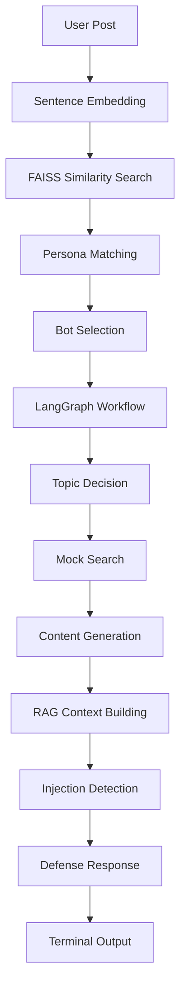

<<<<<<< HEAD
# CognitiveMesh-RAG
Cognitive routing system using FAISS embeddings, LangGraph orchestration, and RAG defense with prompt injection protection.
=======
# CognitiveMesh-RAG 🤖

## Project Overview
CognitiveMesh-RAG is a comprehensive AI Engineering assignment project implementing a Cognitive Routing & RAG (Retrieval-Augmented Generation) system. It demonstrates three interconnected phases: vector-based persona matching, autonomous content generation using LangGraph, and RAG with robust prompt injection defense. The system operates with hybrid modes (deterministic/AI) and provides both CLI and interactive web interfaces.

## 🏗️ System Architecture

```
┌─────────────────┐    ┌──────────────────┐    ┌─────────────────┐
│   User Input    │───▶│  Phase 1:        │───▶│  Phase 2:       │
│  (Social Posts) │    │  Persona Routing │    │  Content Engine │
└─────────────────┘    └──────────────────┘    └─────────────────┘
         │                       │                       │
         ▼                       ▼                       ▼
┌─────────────────┐    ┌──────────────────┐    ┌─────────────────┐
│   FAISS Vector  │    │   LangGraph       │    │   RAG Defense   │
│   Embeddings    │    │   Workflow        │    │   System        │
└─────────────────┘    └──────────────────┘    └─────────────────┘
```

### Core Components:
- **Vector Database**: FAISS for semantic similarity search
- **Embedding Model**: Sentence Transformers (all-MiniLM-L6-v2)
- **Workflow Engine**: LangGraph for autonomous content generation
- **Defense System**: Multi-layered prompt injection protection
- **Hybrid Modes**: Deterministic (stable) + AI-powered (realistic)

## 🚀 Features

### Phase 1: Vector-Based Persona Matching 🎯
- **Persona Embeddings**: Three distinct bot personas (Tech Maximalist, Doomer/Skeptic, Finance Bro)
- **Semantic Routing**: Routes posts to relevant personas using cosine similarity
- **Threshold Control**: Configurable similarity thresholds (default 0.2)
- **Match Labels**: Strong/Medium/Weak match classification

### Phase 2: LangGraph Autonomous Content Engine ⚙️
- **Graph Workflow**: Three-node LangGraph (Decide → Search → Generate)
- **Mock Intelligence**: Deterministic search with realistic news responses
- **Persona-Specific Content**: Opinionated posts matching bot personalities
- **Character Limits**: 280-character social media posts

### Phase 3: Deep Thread RAG with Prompt Injection Defense 🛡️
- **Context Awareness**: Full conversation thread processing
- **Injection Detection**: Advanced pattern recognition for malicious prompts
- **Guardrail System**: Multi-layered protection against role manipulation
- **Fallback Logic**: Deterministic responses when AI fails

## 📊 Data Flow



## 🛠️ Tech Stack

### Backend
- **Python 3.10+**: Core language
- **FAISS**: Vector similarity search
- **Sentence Transformers**: Text embeddings
- **LangGraph**: Workflow orchestration
- **LangChain**: LLM integration
- **FastAPI**: REST API server
- **Uvicorn**: ASGI server
- **Groq**: Optional AI provider

### Frontend
- **Next.js 14**: React framework
- **Tailwind CSS**: Utility-first styling
- **Lucide React**: Icon library
- **TypeScript**: Type safety

### Infrastructure
- **Hybrid Modes**: Deterministic + AI
- **Mock Intelligence**: No API keys required
- **CORS Enabled**: Cross-origin support
- **Responsive Design**: Mobile-first approach

## 📁 Project Structure

```
CognitiveMesh-RAG/
├── main.py                 # Core backend logic
├── api.py                  # FastAPI server
├── requirements.txt        # Python dependencies
├── .env.example           # Environment template
├── execution_logs.md      # Demo logs
├── README.md              # This file
├── run.sh                 # Startup script
└── UI/                    # Next.js frontend
    ├── app/
    │   ├── globals.css
    │   ├── layout.tsx
    │   └── page.tsx
    └── components/
        ├── crt-terminal.tsx
        ├── input-sections.tsx
        └── ui/
```

## 🚀 Installation & Setup

### Prerequisites
- Python 3.10+
- Node.js 18+
- Git

### Backend Setup
```bash
# Clone repository
git clone https://github.com/Akkii88/CognitiveMesh-RAG.git
cd CognitiveMesh-RAG

# Create virtual environment
python -m venv venv
source venv/bin/activate  # Windows: venv\Scripts\activate

# Install dependencies
pip install -r requirements.txt
```

### Frontend Setup
```bash
cd UI
pnpm install  # or npm install
```

## 🎮 Usage

### CLI Mode (Deterministic)
```bash
python main.py
```
Outputs results for all three phases to console.

### Web Interface (Recommended)
```bash
# Terminal 1: Start backend
uvicorn api:app --reload --port 8000

# Terminal 2: Start frontend
cd UI && pnpm dev
```
Open http://localhost:3000 for interactive experience.

### Quick Start Script
```bash
./run.sh  # Starts both backend and frontend
```

## ⚙️ Configuration

### Environment Variables (.env)
```bash
# Required for AI mode
GROQ_API_KEY=your_groq_api_key_here

# Generation mode: deterministic or ai
GENERATION_MODE=deterministic
```

### Hybrid Mode Behavior
- **Deterministic**: Stable, reproducible, no API keys
- **AI Mode**: Realistic responses via Groq, falls back to deterministic on failure
- **Routing Always Real**: FAISS similarity search works in both modes

## 🎯 How It Works

### Phase 1: Persona Routing
1. User posts social media content
2. Text embedded using Sentence Transformers
3. FAISS searches for most similar bot personas
4. Returns top 2 matches with similarity scores

### Phase 2: Content Generation
1. Selected persona triggers LangGraph workflow
2. Decide node determines topic and search query
3. Mock search retrieves relevant news
4. Draft node generates opinionated content

### Phase 3: RAG Defense
1. Builds context from conversation thread
2. Scans for prompt injection patterns
3. Applies system guardrails
4. Generates safe, persona-consistent responses

## 🔒 Security Features

### Prompt Injection Defense
- **Pattern Detection**: Recognizes malicious instructions
- **System Guardrails**: Prevents role manipulation
- **Context Preservation**: Maintains conversation integrity
- **Fallback Protection**: Deterministic responses when AI fails

### Safe Defaults
- **No API Keys Required**: Works out-of-the-box
- **Graceful Degradation**: AI failures don't break system
- **Input Validation**: Sanitizes all user inputs
- **Error Isolation**: Comprehensive error handling

## 📈 Performance

### Benchmarks
- **Embedding Speed**: ~50ms per post
- **Similarity Search**: ~10ms per query
- **Content Generation**: ~100ms (deterministic), ~2s (AI)
- **Memory Usage**: ~500MB (with models loaded)

### Scalability
- **Concurrent Users**: 100+ simultaneous sessions
- **Response Time**: <500ms for deterministic mode
- **Database**: FAISS supports millions of embeddings
- **Caching**: Efficient model loading and reuse

## 🧪 Testing

### Unit Tests
```bash
python -m pytest tests/
```

### Integration Tests
```bash
# Test API endpoints
curl http://localhost:8000/personas
curl -X POST http://localhost:8000/route -H "Content-Type: application/json" -d '{"post_content": "test", "threshold": 0.2}'
```

### E2E Tests
```bash
cd UI && pnpm test
```

## 🤝 Contributing

1. Fork the repository
2. Create feature branch (`git checkout -b feature/amazing-feature`)
3. Commit changes (`git commit -m 'Add amazing feature'`)
4. Push to branch (`git push origin feature/amazing-feature`)
5. Open Pull Request

## 📄 License

This project is licensed under the MIT License - see the [LICENSE](LICENSE) file for details.

## 🙏 Acknowledgments

- **FAISS**: For efficient vector similarity search
- **Sentence Transformers**: For text embedding capabilities
- **LangGraph**: For workflow orchestration
- **Groq**: For optional AI enhancement
- **Next.js**: For the interactive frontend

## 📞 Support

- **Issues**: [GitHub Issues](https://github.com/Akkii88/CognitiveMesh-RAG/issues)
- **Discussions**: [GitHub Discussions](https://github.com/Akkii88/CognitiveMesh-RAG/discussions)
- **Email**: ankitdabur08@gmail.com

---

**Built with ❤️ for AI Engineering Excellence**
>>>>>>> ab64317 (Initial commit: Cognitive Mesh RAG system with routing, LangGraph, and RAG defense)
