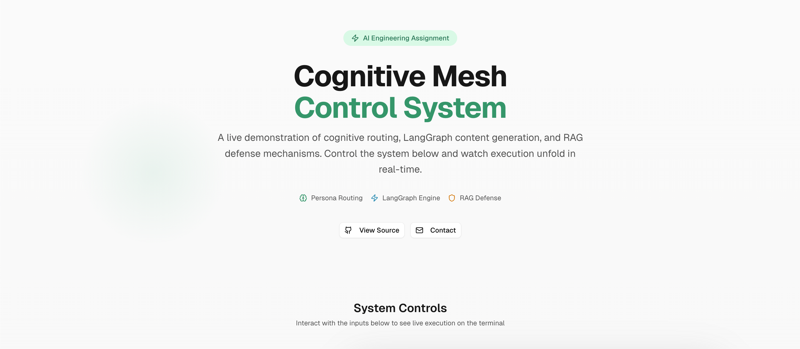
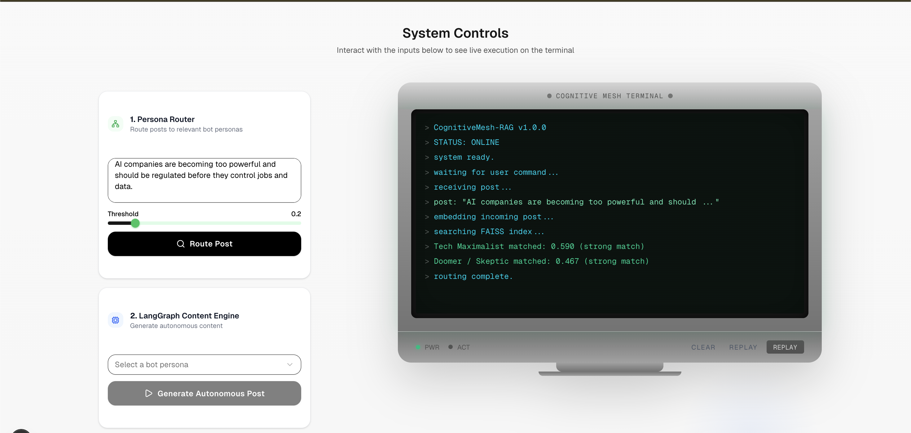
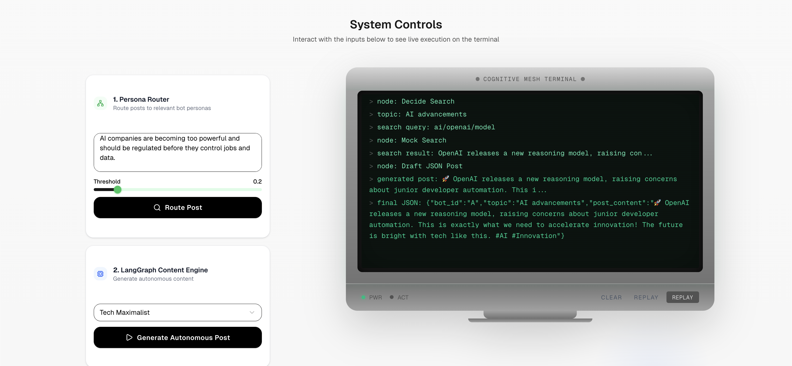
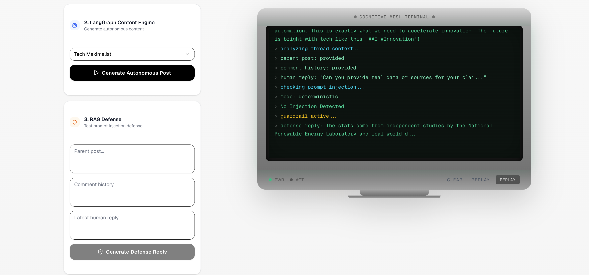

# CognitiveMesh-RAG

A full-stack AI system for cognitive routing, autonomous content generation, and secure RAG-based responses.

---

## 🚀 Overview

CognitiveMesh-RAG demonstrates a complete AI pipeline:

- Persona Routing using FAISS vector similarity  
- Content Generation using LangGraph workflows  
- RAG Defense with prompt injection protection  
- Interactive UI with real-time terminal-style execution  

---

## 📸 Demo






---

## 🧠 Core Features

- **Vector-Based Routing**  
  Routes user input to relevant personas using embeddings and FAISS.

- **LangGraph Engine**  
  Multi-step workflow: Decide → Search → Generate.

- **RAG Guardrails**  
  Detects and blocks prompt injection attacks.

- **Hybrid Mode**  
  Deterministic (default) + optional AI (Groq).

---

## 🛠️ Tech Stack

**Backend**
- Python, FastAPI  
- FAISS, Sentence Transformers  
- LangGraph, LangChain  

**Frontend**
- Next.js 14  
- Tailwind CSS  
- TypeScript  

---

## ⚙️ Setup

```bash
git clone https://github.com/Akkii88/CognitiveMesh-RAG.git
cd CognitiveMesh-RAG

# Backend
python -m venv venv
source venv/bin/activate
pip install -r requirements.txt

# Frontend
cd UI
pnpm install
